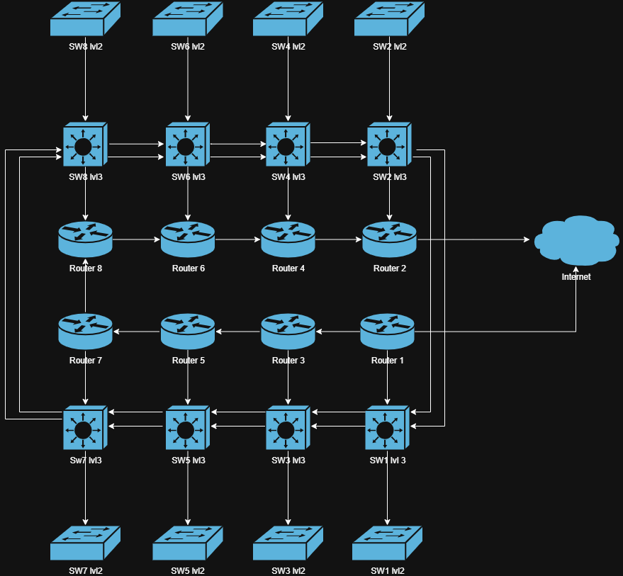

# network diagram
To make it a little simpler to visualize i decided to make 3 diagram.
```
1. network (only showing how network equipement are connected
2. network with IP (added IP addresses of each equipement)
3. network with end devices (showing how end devices are connected to network equipement)
```
There were 2 Windows servers, 2 Freepbx servers, 2 SMTP servers, 2 ubuntu server running GLPI, there were i think 8 proxmox servers and each were running in redundancy with keepalive. Also each group had 2 more ubuntu server running zabbix and grafana and redundancy. I didn't have enough space in my diagram to show all of this so i just put a couple of server to represent them.

## Remark
Also it might seem weird that the IP phones are connected to the server but there is a reason. The IP Phones were suppose to be connected to level 2 swich and computers but are level 2 switch didnt have POE so we had to put them on level 3 Switches which had POE.

# 1. network


# 2. network with IP


# 3. network with end devices
